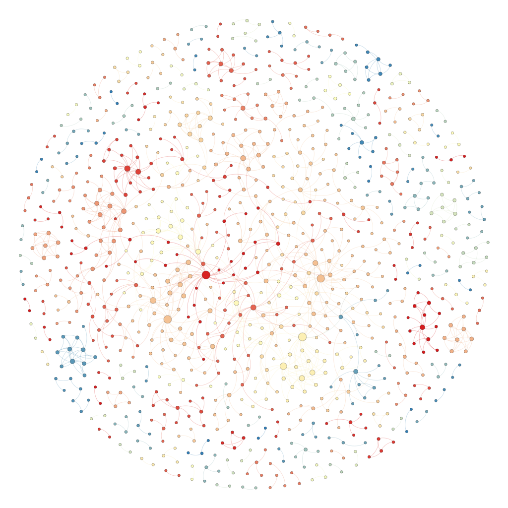
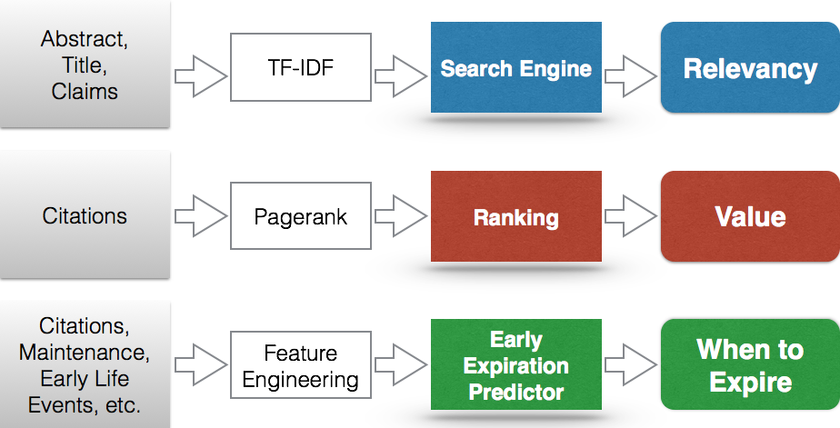
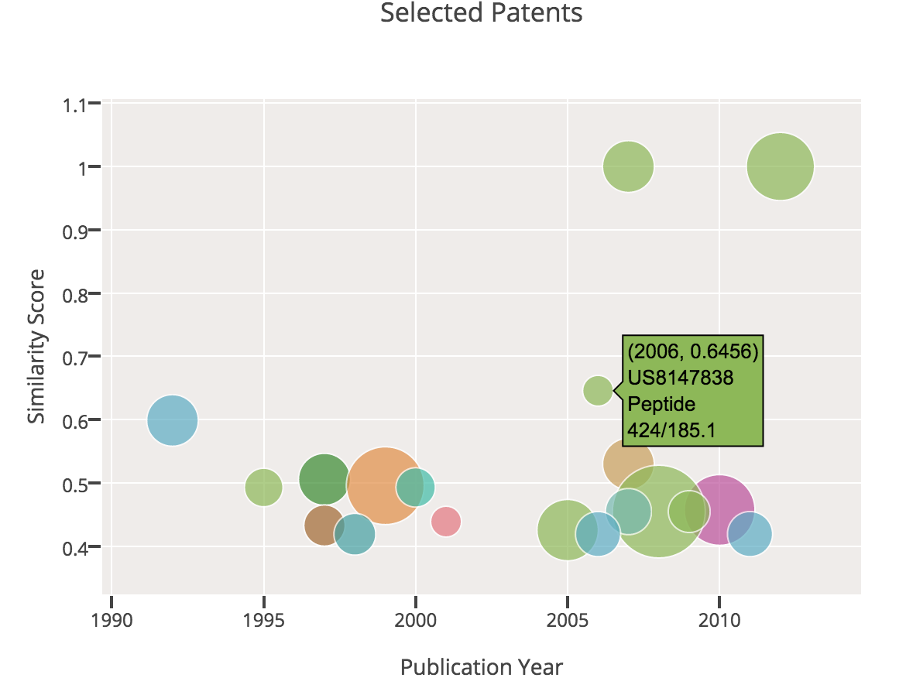

# Hunting4Patents

Hunting4Patents is a tool that finds patents that are valuable but likely to expire early.

I built a custom web scraper to get patent data from several patent websites and built a clean database. To begin with the data, I built a patent search engine based on content similarity comparison to response user's query. To know the importance of a patent, I calculated the PageRank for each patent based on all-time citations. I used Random Forest to predict early expiration by utilizing patent features and early life events. 

[Live Web App](http://ec2-52-10-83-141.us-west-2.compute.amazonaws.com/) (Now available for pharmaceutical patents search)

[Project Proposal](Preliminary_Project_Proposal.md)




# Incentive

We are in a world of inventions. Making inventions and making use of the inventions are key to a company's success.

US patent law grants the patent owner exclusive rights of the invention for 20 years. By granting the right to produce a new product without fear of competition, patents provide incentive for companies or individuals to continue developing innovative new products or services. 

One example is that pharmaceutical companies spend large sums on research and development and patents are essential to earning a profit.

On the other hand, if you own a business and you want to make use of others' patents for your business, you may want to find a way to identify those patents that (1) are related to your business, (2) valuable, for example in terms of popularity in the field, and (3) are likely to expire soon.

Therefore, the goal of this project to build a tool that calculates the metrics for these 3 needs and makes the best recommendations.

* RELEVANCY
* VALUE
* WHEN TO EXPIRE

# Data

I scraped and downloaded patent data from the following website:

* [Google Patent Search](http://www.google.com/patents)
* [Freepatentsonline](http://www.freepatentsonline.com)
* [USPTO Patent Assignment Search](http://assignment.uspto.gov) 
* [USPTO Patent Maintenance Fee Events](https://eipweb.uspto.gov/MaintFeeEvents/)
* [Harvard Patent Network Dataverse](https://thedata.harvard.edu/dvn/dv/patent/faces/study/StudyPage.xhtml?globalId=hdl:1902.1/12367&studyListingIndex=0_b547d55c3b44eda0c6f7707020be)

The initial implementation collected 2465 patents in the field of pharmaceutical industry. 


# Features

Features are the useful properties underlying the raw data. I extracted the following features to build my models

* Patent text content
	* --> to be converted to tf-idf vectors

* Patent citation
	* --> to be modeled as connections between patents

* Bibliographical information, maintenance events, etc.
	* --> to be utilized for feature engineering


# Models

The goal is to find 3 metrics of RELEVANCY, VALUE, WHEN TO EXPIRE, so I built a model for each aspect.

1. Search Engine
	- Tool: Natural Language Processing
	- Features: tf-idf vectors
	- How: calculate similarity score weighted by title, abstract, and claims, and return the patents with highest similarity

2. Ranking
	- Tool: network and [PageRank](http://en.wikipedia.org/wiki/PageRank)
	- Features: all-time citations
	- How: get 1 level depth forward citation for each patent, then calculate the PageRank by either using graphlab package or solving eigen-problem of the transition matrix

3. Predictor of Early Expiration
	- Tool: feature engineering
	- Features: backward patent citations, backward non-patent citaitons, ratio of backward citations made by inventor to made by patent examiner, semantic analysis, post issuance records
	- How: convert features into numerics and build a Random Forrest Classifier with sklearn. Train the model with already expired patent data (early expiration and natural expiration). Use GridSearch to find the best estimator. Then make predictions for current live patents.


# Product

[Live Web App](http://ec2-52-10-83-141.us-west-2.compute.amazonaws.com/) (Now available for pharmaceutical patents search)


# Workflow

The overall workflow consists of the following parts:
	data --> features --> models --> result delivery




Phase 1: get data
=======================================

1) filename:  get_data_patent_content.py
```
	INPUT: None
	OUTPUT: MongoDB database file -> ./database/patent_database.patent_fields
	POINTS TO: clean_my_data.py
```
Purpose: download all patent data from patent topics "Drugs / Vasodialators / Gene Therapy / Other Drug Related" from webstie: 'freepatentsonline'

How: using bs4 + requests, go to the pages that have all of the industry patents, get all the patent numbers. Then go to all the individual patent pages. from that page scrape the 'filling date', 'primary classes', 'other classes', 'US patent references', 'Attorney, Agent or Firm', 'link', 'title', 'abstract', 'claims', 'description'
then store all that information into database

2) filename:  get_data_maintenance.py
```
	INPUT: maintenancefee.txt
	OUTPUT: Patent maintenance database file -> ./my_database/database_maintenance.sqlite3
	POINTS TO: clean_my_data.py
```
Purpose: parse maintenancefee.txt, get maintenance action records for each patent then store all that information into database

3) filename:  get_patent_status.py
```
	INPUT: None
	OUTPUT: Patent database file -> ./my_database/patent_database.patent_status
	POINTS TO: clean_my_data.py
```
Purpose: scrape status data of individual patent from google patents,
then store all that iinformation into database 'patent_database.patent_status'


Phase 2: clean my database
=======================================
filename: clean_my_data.py
```
	INPUT: patent_database
	OUTPUT: combined patent database file -> ./my_database/patent_dataframe.pkl
	POINTS TO: get_reference_data.py
```
why:  store patent info given from get_data_content.py + get_patent_status.py + get_data_maintenance.py

how: read data from mongodb, sqlite3 from database_core + database_assignment + database_maintenance, and convert to patent_dataframe.pkl


Phase 3: populate data
=======================================
1) filename: get_reference_data.py
```
	INPUT: pandas dataframe patent_database.pkl
	OUTPUT: reference relation database -> ./my_database/citation_database
	POINTS TO: get_reference_relations.py
```
why: extract patent citation data

how: use pandas to create new database called citation_database, which includes patent number and 1 level forward citations.

2) filename: get_reference_relations.py
```
	INPUT: citation_database
	OUTPUT: citation relation file -> ./my_data/citation.csv
	POINTS TO: calc_pagerank.py
```
why: get rows of one-to-one citation relation

how: use pandas pivot_table 

3) filename: get_patent_text.py
```
	INPUT: patent_dataframe.pkl
	OUTPUT: pandas dataframe file -> ./my_database/patent_text.pkl
	POINTS TO: patent_tokenizer.py, patent_matcher.py
```


Phase 4: build model
=======================================

Model 1: similarity
---------------------------------------
3) filename: patent_matcher.py
```
	INPUT: 
	OUTPUT: 
	POINTS TO: app.py
```

Model 2: pagerank
---------------------------------------
1) filename: calc_pagerank.py
```
	INPUT: citation_database.csv
	OUTPUT: table_pagerank
	POINTS TO: app.py
```
why: calculate pagerank

how: use graphlab to calculate

Model 3: early expiration predictor
---------------------------------------
2) filename: patent_life_predictor.py
```
	INPUT: 
	OUTPUT: 
	POINTS TO: app.py
```


Phase 5: visualization
=======================================
```
	INPUT: patent_dataframe.pkl
	OUTPUT: table, chart
	POINTS TO: web app
```
What: graph, table

How: use plot.ly


Phase 6: web app
=======================================
```
	INPUT: patent_dataframe.pkl, patent_text.pkl, user's query
	OUTPUT: html pages
```


# Code Structure

```
-- HUNTING4PATENTS/
|	|-- CODE/
|	|	|-- get_data_patent_content.py
|	|	|-- get_data_maintenance.py
|	|	|-- get_patent_status.py
|	|	|-- -- clean_my_database.py
|	|	|-- -- get_reference_data.py
|	|	|-- -- -- calc_pagerank.py
|	|	|-- -- -- patent_matcher.py
|	|	|-- -- -- patent_tokenizer.py
|	|-- APP/
|	|	|-- app.py (based on Flask)
|	|	|-- my_plot_plotly.py
|	|	|-- patent_matcher.py (copied from ../CODE/)
|	|	|-- patent_tokenizer.py (copied from ../CODE/)
|	|-- DATABASE/
|	|	|-- maintenance.txt
|   |   |-- citation.sqlite3
```

# Findings

Result to a sample query:


Citation network of a collection of patents:


